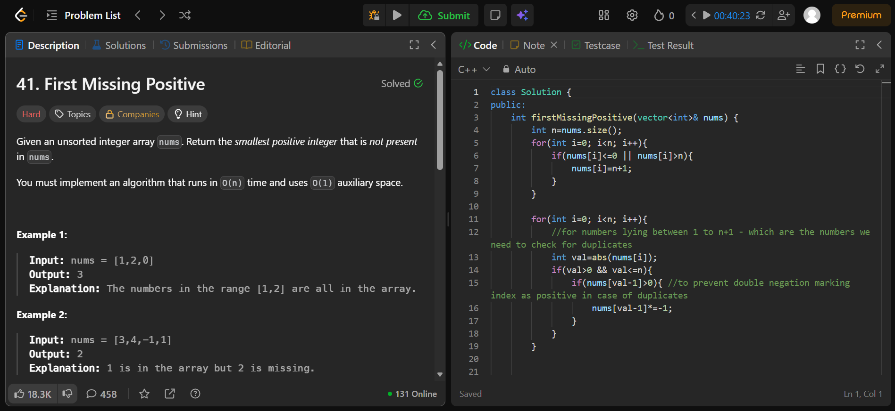

```cpp
#include<bits/stdc++.h>
using namespace std;

class Solution {
public:
    int firstMissingPositive(vector<int>& nums) {
        int n=nums.size();
        for(int i=0; i<n; i++){
            if(nums[i]<=0 || nums[i]>n){
                nums[i]=n+1;
            }
        }

        for(int i=0; i<n; i++){
            int val=abs(nums[i]);
            if(val>0 && val<=n){
                if(nums[val-1]>0){
                    nums[val-1]*=-1;
                }
            }
        }

        for(int i=0; i<n; i++){
            if(nums[i]>0){
                return i+1;
            }
        }
        return n+1;
    }
};
```



```cpp
class Solution {
public:
    int subarraySum(vector<int>& nums, int k) {
        unordered_map<int, int> sum;
        sum[0]=1;
        int prefix=0, cnt=0;

        for(int i=0; i<nums.size(); i++){
            prefix+=nums[i];
            int rem=prefix-k;
            cnt+=sum[rem];
            sum[prefix]+=1;
        }
        return cnt;
    }
};
```

