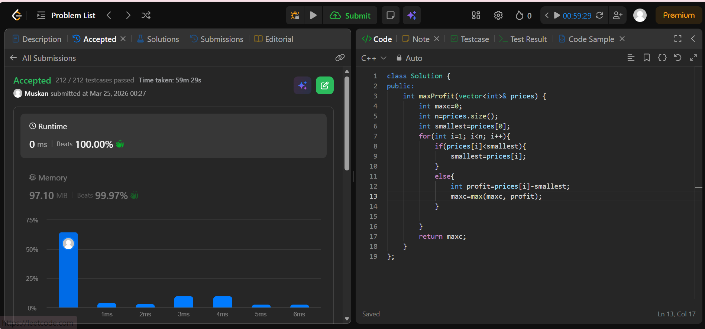
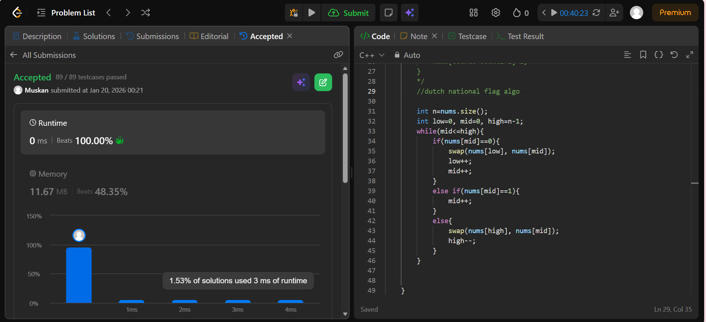

```cpp
#include<bits/stdc++.h>
using namespace std;
class Solution {
public:
    int maxProfit(vector<int>& prices) {
        int maxc=0;
        int n=prices.size();
        int smallest=prices[0];
        for(int i=1; i<n; i++){
            if(prices[i]<smallest){
                smallest=prices[i];
            }
            else{
                int profit=prices[i]-smallest;
                maxc=max(maxc, profit);
            }
            
        }
        return maxc;
    }
};
```


```cpp
#include<bits/stdc++.h>
using namespace std;
class Solution {
public:
    void sortColors(vector<int>& nums) {
        /*
        int count0=0;
        int count1=0;
        int count2=0;
        for(int i=0; i<nums.size();i++){
            if(nums[i]==0){
                count0++;
            }
            if(nums[i]==1){
                count1++;
            }
            if(nums[i]==2){
                count2++;
            }
        }
        for(int i=0; i<count0; i++){
            nums[i]=0;
        }
        for(int i=0; i<count1; i++){
            nums[count0+i]=1;
        }
        for(int i=0; i<count2; i++){
            nums[count0+count1+i]=2;
        }
        */
        //dutch national flag algo

        int n=nums.size();
        int low=0, mid=0, high=n-1;
        while(mid<=high){
            if(nums[mid]==0){
                swap(nums[low], nums[mid]);
                low++;
                mid++;
            }
            else if(nums[mid]==1){
                mid++;
            }
            else{
                swap(nums[high], nums[mid]);
                high--;
            }
        }


    }
};
```

