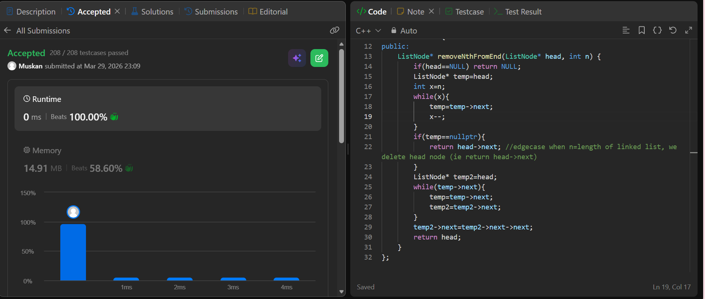

```cpp
/**
 * Definition for singly-linked list.
 * struct ListNode {
 *     int val;
 *     ListNode *next;
 *     ListNode() : val(0), next(nullptr) {}
 *     ListNode(int x) : val(x), next(nullptr) {}
 *     ListNode(int x, ListNode *next) : val(x), next(next) {}
 * };
 */
class Solution {
public:
    ListNode* removeNthFromEnd(ListNode* head, int n) {
        if(head==NULL) return NULL;
        ListNode* temp=head;
        int x=n;
        while(x){
            temp=temp->next;
            x--;
        }
        if(temp==nullptr){
            return head->next; //edgecase when n=length of linked list, we delete head node (ie return head->next)
        }
        ListNode* temp2=head;
        while(temp->next){
            temp=temp->next;
            temp2=temp2->next;
        }
        temp2->next=temp2->next->next;
        return head;
    }
};

```
