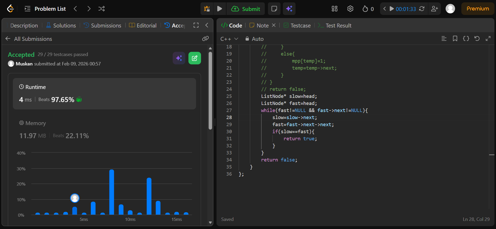

```cpp
/**
 * Definition for singly-linked list.
 * struct ListNode {
 *     int val;
 *     ListNode *next;
 *     ListNode(int x) : val(x), next(NULL) {}
 * };
 */
class Solution {
public:
    bool hasCycle(ListNode *head) {
        // if(head==NULL) return false;
        // map<ListNode* ,int> mpp;
        // ListNode* temp=head;
        // while(temp!=NULL){
        //     if(mpp[temp]==1){
        //         return true;
        //     }
        //     else{
        //         mpp[temp]=1;
        //         temp=temp->next;
        //     }
        // }
        // return false;
        ListNode* slow=head;
        ListNode* fast=head;
        while(fast!=NULL && fast->next!=NULL){
            slow=slow->next;
            fast=fast->next->next;
            if(slow==fast){
                return true;
            }
        }
        return false;
    }
};
```
