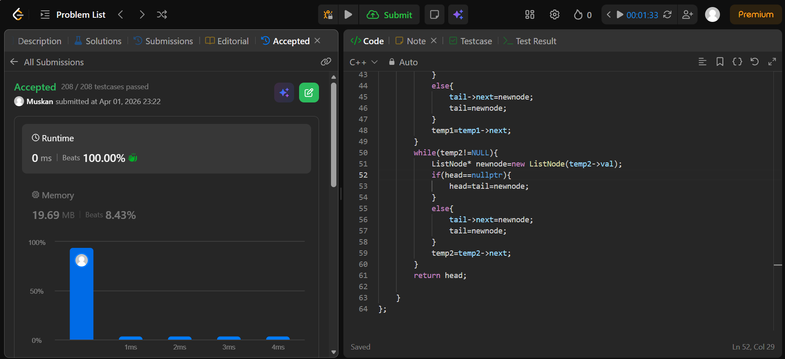

```cpp
/**
 * Definition for singly-linked list.
 * struct ListNode {
 *     int val;
 *     ListNode *next;
 *     ListNode() : val(0), next(nullptr) {}
 *     ListNode(int x) : val(x), next(nullptr) {}
 *     ListNode(int x, ListNode *next) : val(x), next(next) {}
 * };
 */
class Solution {
public:
    ListNode* mergeTwoLists(ListNode* list1, ListNode* list2) {
        ListNode* head=nullptr;
        ListNode* tail=nullptr;
        ListNode* temp1=list1;
        ListNode* temp2=list2;
        
        while(temp1!=NULL && temp2!=NULL){
            int value;
            if(temp1->val<=temp2->val){
                value=temp1->val;
                temp1=temp1->next;
            }
            else {
                value=temp2->val;
                temp2=temp2->next;
            }
        ListNode* newnode=new ListNode(value);
        if(head==nullptr){
            head=tail=newnode;
        }
        else{
            tail->next=newnode;
            tail=newnode;
        }
        }
        while(temp1!=NULL){
            
            ListNode* newnode=new ListNode(temp1->val);
            if(head==nullptr){
                head=tail=newnode;
            }
            else{
                tail->next=newnode;
                tail=newnode;
            }
            temp1=temp1->next;
        }
        while(temp2!=NULL){
            ListNode* newnode=new ListNode(temp2->val);
            if(head==nullptr){
                head=tail=newnode;
            }
            else{
                tail->next=newnode;
                tail=newnode;
            }
            temp2=temp2->next;
        }
        return head;
        
    }
};
```
