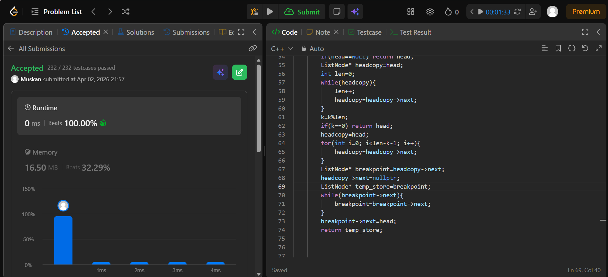

```cpp
/**
 * Definition for singly-linked list.
 * struct ListNode {
 *     int val;
 *     ListNode *next;
 *     ListNode() : val(0), next(nullptr) {}
 *     ListNode(int x) : val(x), next(nullptr) {}
 *     ListNode(int x, ListNode *next) : val(x), next(next) {}
 * };
 */
class Solution {
public:
    // ListNode* reverse(ListNode* head){
    //     // ListNode* curr=head;
    //     // ListNode* prev=nullptr;
    //     // ListNode* next=nullptr;

    //     // while(curr!=NULL){
    //     //     next=curr->next;
    //     //     curr->next=prev;
    //     //     prev=curr;
    //     //     curr=next;
    //     // }
    //     // return prev;
    // }
    ListNode* rotateRight(ListNode* head, int k) {
        // if(head==NULL || k==0) return head;
        // ListNode* temp=head;
        // int count=0;
        // while(temp!=NULL){
        //     temp=temp->next;
        //     count++;
        // }
        // k=k%count;
        // if(k==0) return head;
        // temp=head;
        // int track=count-k;
        // while(track>1){
        //     temp=temp->next;
        //     track--;
        // }
        // ListNode* start=temp->next;
        // temp->next=nullptr;
        // ListNode* first=reverse(head);
        // ListNode* second=reverse(start);

        // temp=first;
        // while(temp->next){
        //     temp=temp->next;
        // }
        // temp->next=second;
        // return reverse(first);

        if(head==NULL) return head;
        ListNode* headcopy=head;
        int len=0;
        while(headcopy){
            len++;
            headcopy=headcopy->next;
        }
        k=k%len;
        if(k==0) return head;
        headcopy=head;
        for(int i=0; i<len-k-1; i++){
            headcopy=headcopy->next;
        }
        ListNode* breakpoint=headcopy->next;
        headcopy->next=nullptr;
        ListNode* temp_store=breakpoint;
        while(breakpoint->next){
            breakpoint=breakpoint->next;
        }
        breakpoint->next=head;
        return temp_store;


        
    }
};
```
