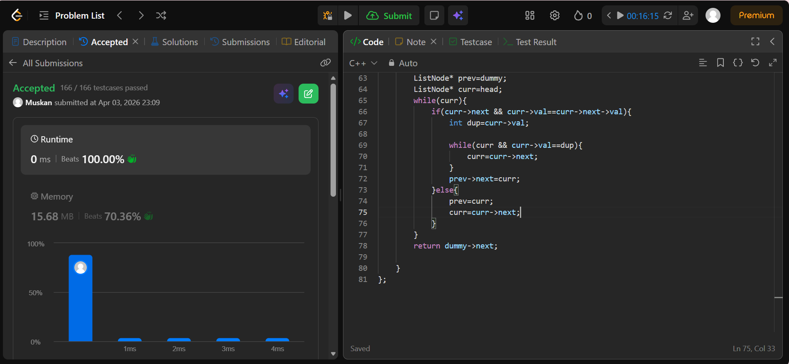

```cpp
/**
 * Definition for singly-linked list.
 * struct ListNode {
 *     int val;
 *     ListNode *next;
 *     ListNode() : val(0), next(nullptr) {}
 *     ListNode(int x) : val(x), next(nullptr) {}
 *     ListNode(int x, ListNode *next) : val(x), next(next) {}
 * };
 */
class Solution {
public:
    ListNode* deleteDuplicates(ListNode* head) {
        // stack<int> st;
        // ListNode* temp=head;
        // while(temp){
        //     if(temp->next && temp->val==temp->next->val){
        //         int dup=temp->val;
        //         temp=temp->next;
            
        //         while (temp && temp->val == dup) {
        //             temp = temp->next;
        //         }
                
        //         while(!st.empty() && st.top()==dup){
        //             st.pop();
        //         }
        //     }
        //     else{
        //         st.push(temp->val);
        //         temp = temp->next;
        //     }
            

        // }
        // ListNode* head1=nullptr;
        // ListNode* tail1=nullptr;
       
        // while(!st.empty()){
        //     ListNode* newNode= new ListNode(st.top());
        //     if(head1==nullptr){
        //         head1=tail1=newNode;
        //     }else{
        //         tail1->next=newNode;
        //         tail1=newNode;
        //     }
        //     st.pop();
        // }
        
        // ListNode* prev=nullptr;
        // ListNode* curr=head1;
        // ListNode* next=nullptr;
        // while(curr){
        //     next=curr->next;
        //     curr->next=prev;
        //     prev=curr;
        //     curr=next;
        // }
        // return prev;
        if (!head || !head->next) return head;
        ListNode* dummy=new ListNode(0);
        dummy->next=head;
        ListNode* prev=dummy;
        ListNode* curr=head;
        while(curr){
            if(curr->next && curr->val==curr->next->val){
                int dup=curr->val;
            
                while(curr && curr->val==dup){
                    curr=curr->next;
                }
                prev->next=curr;
            }else{
                prev=curr;
                curr=curr->next;
            }
        }
        return dummy->next;
    
    }
};
```
