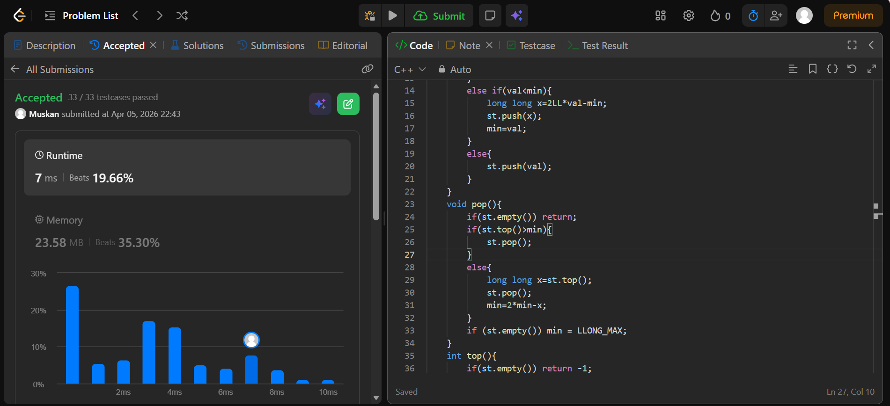

```cpp
class MinStack {
public:
    long long min;
    stack<long long> st;
    MinStack(){
        min=LLONG_MAX;
    }
    void push(int val){
        if(st.empty()){
            st.push(val);
            min=val;
            return; //imp
        }
        else if(val<min){
            long long x=2LL*val-min;
            st.push(x);
            min=val;
        }
        else{
            st.push(val);
        }
    }
    void pop(){
        if(st.empty()) return;
        if(st.top()>min){
            st.pop();
        }
        else{
            long long x=st.top();
            st.pop();
            min=2*min-x;
        }
        if (st.empty()) min = LLONG_MAX;
    }
    int top(){
        if(st.empty()) return -1;
        if(st.top()<min) return (int)min;
        else return (int) st.top();
    }
    int getMin(){
        if(st.empty()) return -1;
        return (int) min;
    }
};

/**
 * Your MinStack object will be instantiated and called as such:
 * MinStack* obj = new MinStack();
 * obj->push(val);
 * obj->pop();
 * int param_3 = obj->top();
 * int param_4 = obj->getMin();
 */
 ```
 