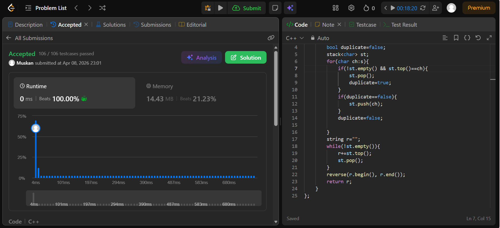

```cpp
class Solution {
public:
    string removeDuplicates(string s) {
        bool duplicate=false;
        stack<char> st;
        for(char ch:s){
            if(!st.empty() && st.top()==ch){
                st.pop();
                duplicate=true;
            }
            if(duplicate==false){
                st.push(ch);
            }
            duplicate=false;

        }
        string r="";
        while(!st.empty()){
            r+=st.top();
            st.pop();
        }
        reverse(r.begin(), r.end());
        return r;
    }
};
```
