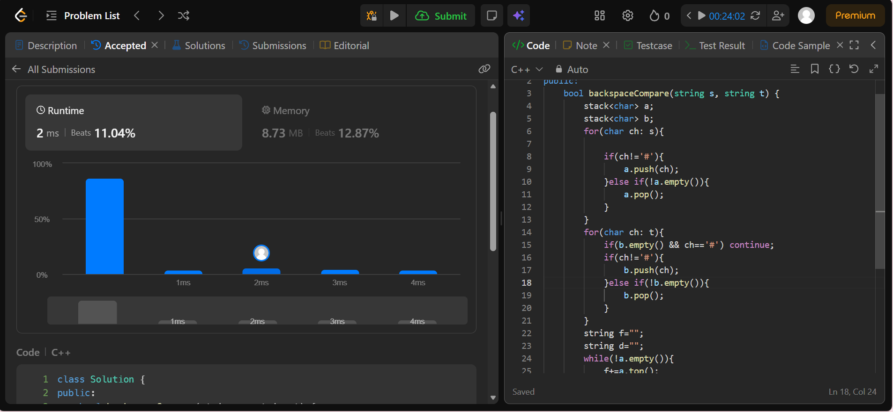

```cpp
class Solution {
public:
    bool backspaceCompare(string s, string t) {
        stack<char> a;
        stack<char> b;
        for(char ch: s){
            
            if(ch!='#'){
                a.push(ch);
            }else if(!a.empty()){
                a.pop();
            }
        }
        for(char ch: t){
            if(b.empty() && ch=='#') continue;
            if(ch!='#'){
                b.push(ch);
            }else if(!b.empty()){
                b.pop();
            }
        }
        string f="";
        string d="";
        while(!a.empty()){
            f+=a.top();
            a.pop();
        }
        while(!b.empty()){
            d+=b.top();
            b.pop();
        }
        return f==d;
    }
};
```
