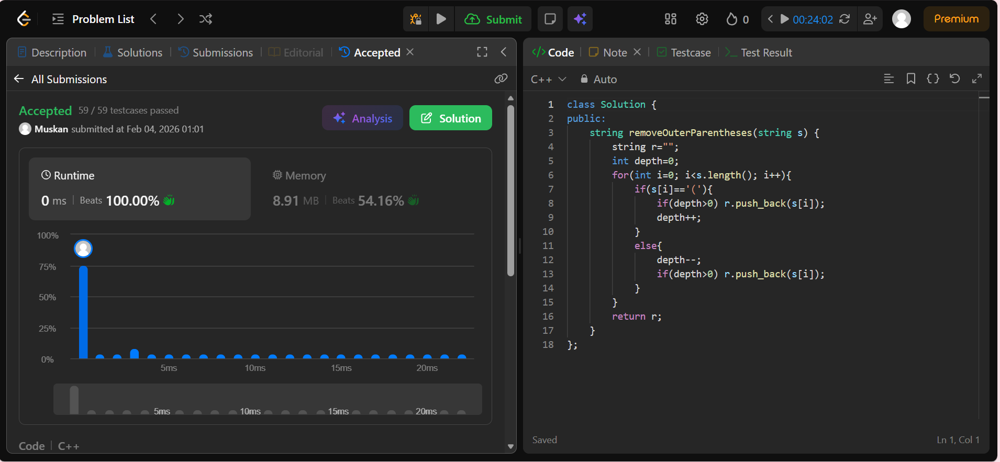

```cpp
class Solution {
public:
    string removeOuterParentheses(string s) {
        string r="";
        int depth=0;
        for(int i=0; i<s.length(); i++){
            if(s[i]=='('){
                if(depth>0) r.push_back(s[i]);
                depth++;
            }
            else{
                depth--;
                if(depth>0) r.push_back(s[i]);
            }
        }
        return r;
    }
};
```
