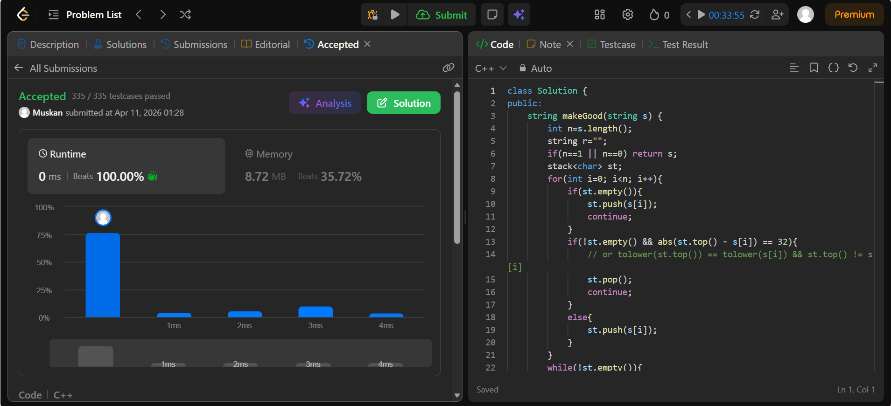

```cpp
class Solution {
public:
    string makeGood(string s) {
        int n=s.length();
        string r="";
        if(n==1 || n==0) return s;
        stack<char> st;
        for(int i=0; i<n; i++){
            if(st.empty()){
                st.push(s[i]);
                continue;
            }
            if(!st.empty() && abs(st.top() - s[i]) == 32){
                // or tolower(st.top()) == tolower(s[i]) && st.top() != s[i]
                st.pop();
                continue;
            }
            else{
                st.push(s[i]);
            }
        }
        while(!st.empty()){
            r+=st.top();
            st.pop();
        }
        reverse(r.begin(), r.end());
        return r;
    }
};
```
